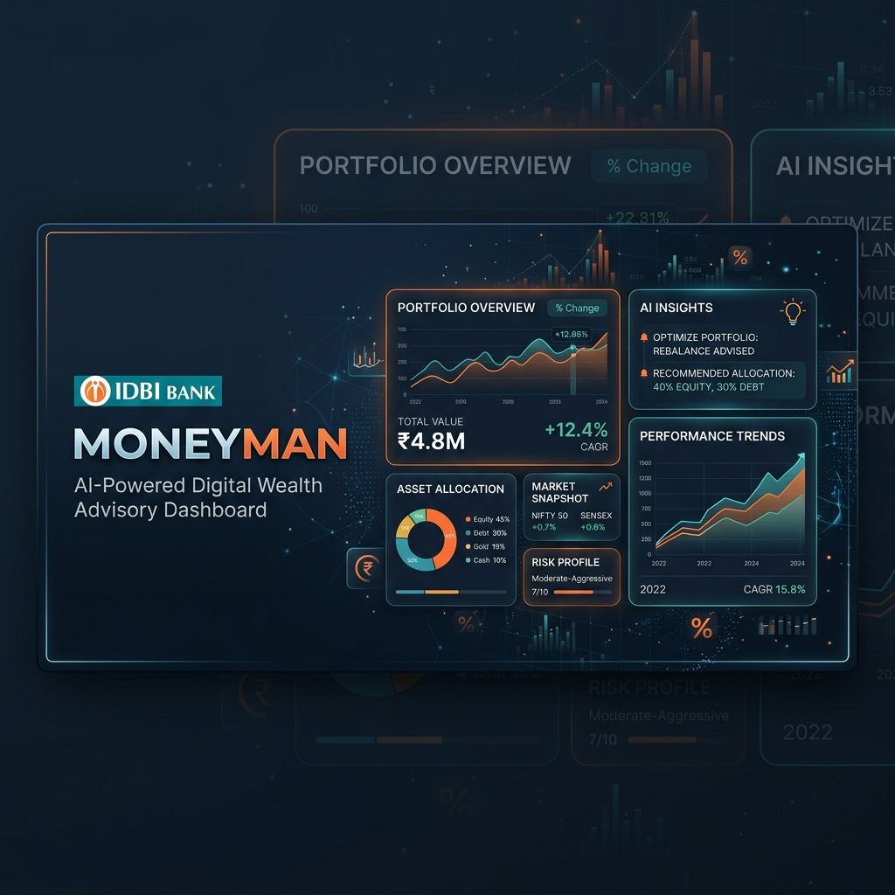
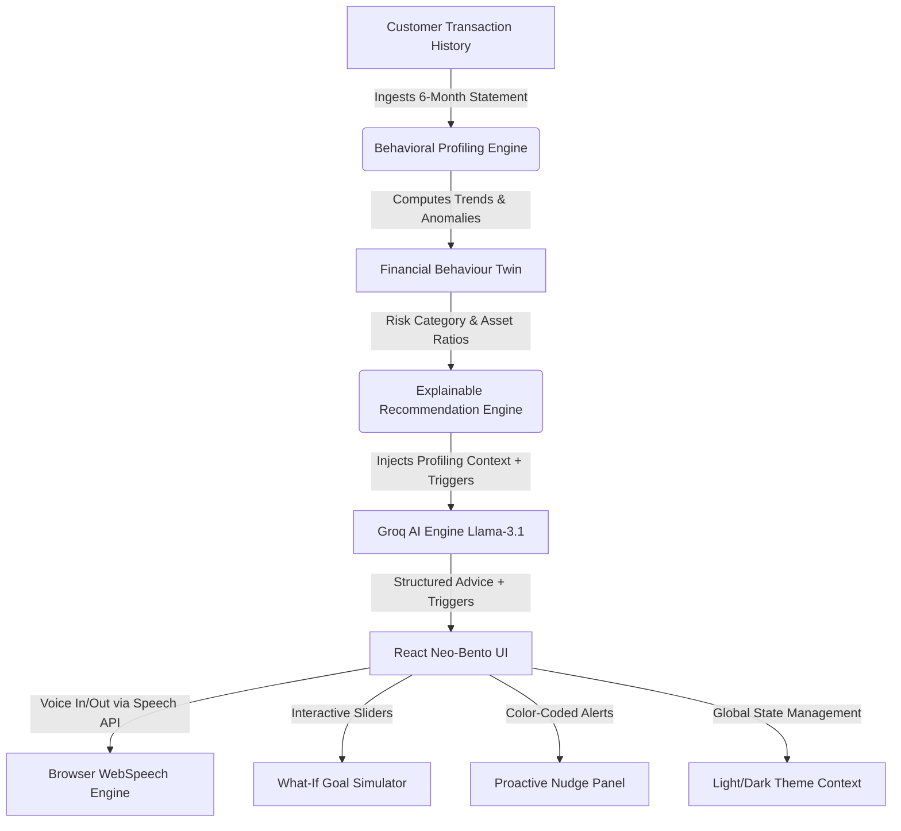
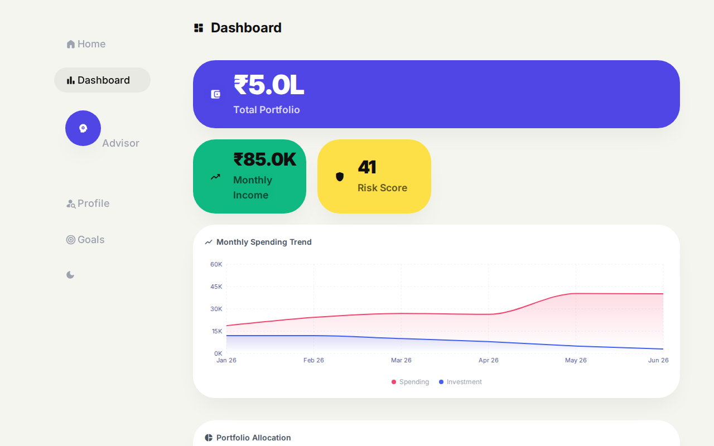
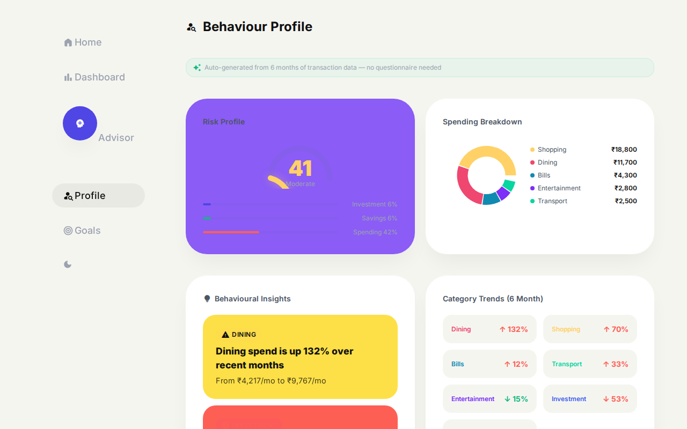
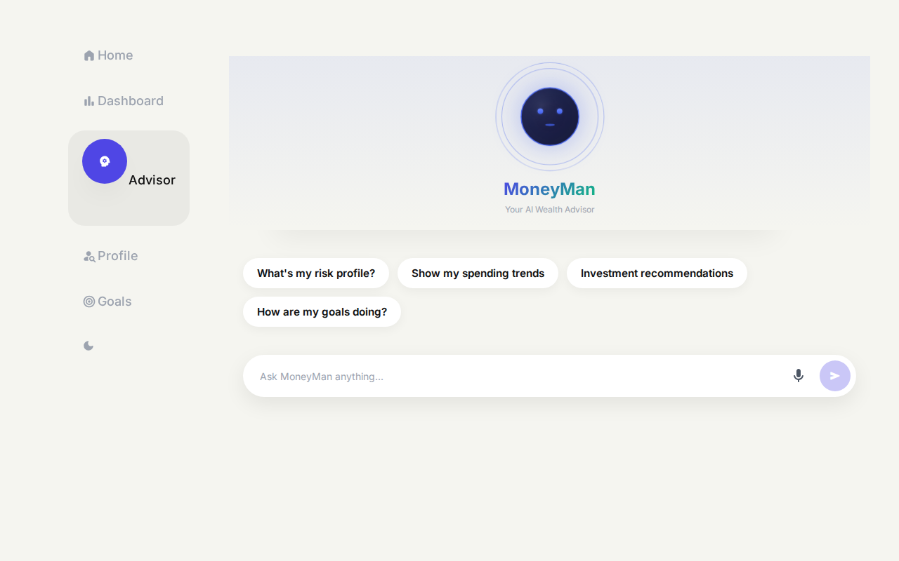
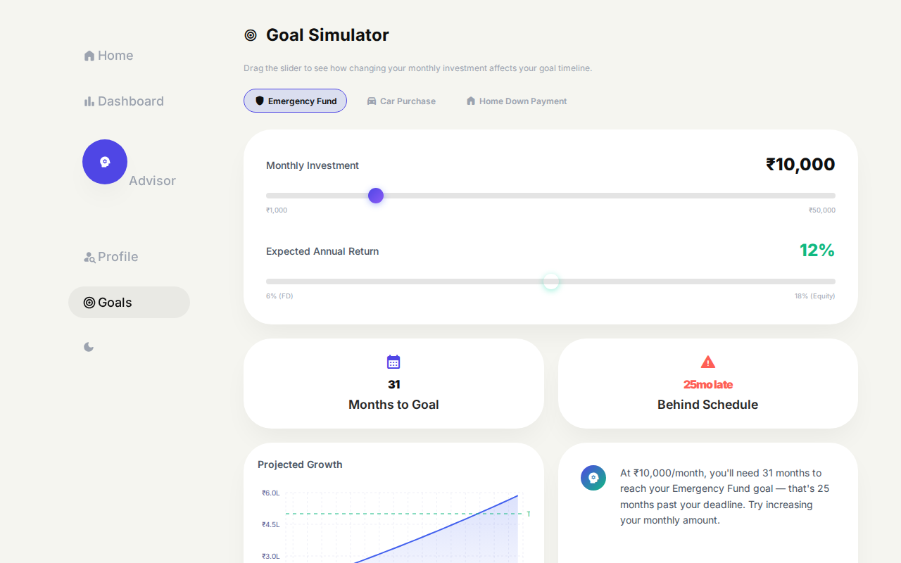

# 🏦 MoneyMan — AI-Powered Digital Wealth Advisory Avatar

[](https://github.com/Durgaprasad-Developer/MoneyMan)
[](https://github.com/Durgaprasad-Developer/MoneyMan)
[](https://opensource.org/licenses/MIT)

---



> **Built for IDBI Innovate 2026 — Track 01: AI-Powered Digital Wealth Advisory**  
> **Live Production Link:** [https://moneyman-27st.onrender.com/](https://moneyman-27st.onrender.com/)

---

## 💡 The Core Vision

Wealth advisory in standard banking applications is historically static, fragmented, and detached from a customer's true financial lifestyle. Traditional systems force customers to fill out tedious, multi-step risk assessment questionnaires, leading to high abandonment rates and outdated investor risk scores.

**MoneyMan** redefines this paradigm by serving as a seamless plug-and-play module for the IDBI ecosystem. Rather than asking static questions, it silently constructs a dynamic **"Financial Behaviour Twin"** of the customer by parsing historical transaction data. It automatically scores risk profiles, monitors spending anomalies, generates audit-friendly explainable advice, and acts as a voice-enabled conversational wealth advisor.

---

## 🏗️ System Architecture & Data Flow

MoneyMan is architected to prove feasibility for a bank-scale integration. The engine consists of a lightweight React frontend and an analytics-driven Node.js/Express backend that feeds structured context directly to the LLM.



---

## 🌟 The "Wow" Factors (Key Features)

### 1. Dynamic Financial Behaviour Twin
Instead of static risk forms, MoneyMan continuously analyzes 6 months of historical transactions. It automatically calculates:
*   **Risk Profile & Category** (Conservative, Moderate, Aggressive).
*   **Asset Ratios** (Investment-to-Income, Savings-to-Income, Spending-to-Income).
*   **Spend Anomalies** (e.g., alert when dining spend spikes by 132% or SIP reduces by 53%).

### 2. Live Conversational Advisor with Audio Feedback
A friendly, interactive wealth assistant powered by:
*   **Groq (Llama-3.1-8B)**: Near-zero latency response generation.
*   **WebSpeech API**: Native, local browser text-to-speech engine ensuring zero server latency and **zero marginal cost** per audio stream.
*   **Interactive State Animations**: The avatar dynamically transitions between *Idle*, *Listening*, *Thinking*, and *Speaking* states, synced directly with WebSpeech API events.

### 3. Fully Explainable Advisory Engine
To comply with financial regulations and audit guidelines, every single suggestion provided by the AI has a clear **Triggers** list. If MoneyMan suggests increasing a SIP or shifting capital to debt funds, it clearly exposes the "Why" (e.g., *Trigger: Savings rate has declined by 60%*).

### 4. Interactive "What-If" Goal Simulator
A visual tool showing the long-term impact of monthly saving decisions. Users adjust a fluid range slider to simulate changes in their monthly investment (SIP). The charts and months-to-goal progress update in real-time with automatic warnings if they fall behind schedule.

### 5. Premium Neo-Bento Design System
Designed to meet global Visa/Mastercard aesthetic standards:
*   Modern Soft-Brutalist "Bento Grid" layout.
*   Massive typography (`font-weight: 900`) for clear financial legibility.
*   Massive, tactile rounded card layouts (`32px`–`40px`).
*   Global unified **Light & Dark mode** toggle accessible from the sidebar.

---

## 📸 Product Interface & Visual Proof

### 📊 Portfolio Dashboard
The primary landing zone, visualizing total portfolio value, asset allocation, monthly income, and dynamic spending trends.


### 👤 Financial Behaviour Twin & Profiling
Exposes the computed risk score, spending category breakdowns, and dynamic risk category categorization without needing any questionnaires.


### 🗣️ Voice-Activated AI Wealth Avatar
An interactive audio-supported agent with low latency, showcasing dynamic mouth states and chat history bubbles.


### 📈 Goal Simulator
Allows the customer to drag sliders in real-time to simulate investment growth, goal timelines, and shortfall alerts.


---

## 🛠️ Technology Stack

| Component | Technology | Role |
| :--- | :--- | :--- |
| **Frontend** | React 18, Vite 5 | Core Application Shell, state-driven user experience |
| **Styling** | Vanilla CSS Variables | Design system tokens (border-radius, shadow tokens, theme palettes) |
| **Visualizations**| Recharts | High-performance interactive financial charts |
| **Animations** | Framer Motion | Fluid card entries, tab transitions, and avatar state physics |
| **Voice Engine** | Web Speech API | Client-side zero-latency Text-to-Speech & Speech-to-Text |
| **Backend** | Express 5, Node.js | Microservice serving API endpoints, profiling & nudge logic |
| **LLM Inference** | Groq Cloud SDK | Blazing fast responses using `llama-3.1-8b-instant` |

---

## ⚙️ Local Setup Instructions

Follow these steps to run the application locally on your machine.

### Prerequisites
*   [Node.js](https://nodejs.org/) (v18 or higher recommended)
*   npm (installed automatically with Node)

### 1. Clone the Repository
```bash
git clone https://github.com/Durgaprasad-Developer/MoneyMan.git
cd MoneyMan
```

### 2. Install Dependencies
```bash
npm install
```

### 3. Set Up Environment Variables
Create a file named `.env` in the root directory:
```bash
GROQ_API_KEY=your_groq_api_key_here
```
*(Get your free API key from the [Groq Console](https://console.groq.com/))*

### 4. Start the Application
Run the concurrent development command which launches both the Express backend server (port `3002`) and the Vite React frontend server (port `5173`):
```bash
npm run dev
```

Open your browser and navigate to `http://localhost:5173`.

---

## 🚀 Production Deployment Configuration

This repository is optimized for deployment as a single **monolithic web service** on platforms like Render, Railway, or Heroku. The Express backend automatically serves the production build assets (`dist/`) created by Vite.

### Deployment Settings:
*   **Build Command**: `npm install && npm run build`
*   **Start Command**: `node server/index.js`
*   **Environment Variables**:
    *   `GROQ_API_KEY`: *(your live Groq SDK key)*
    *   `NODE_ENV`: `production`

---

## 📂 Project Structure

```
├── dist/                   # Compiled static production build assets (Vite output)
├── server/                 # Express backend APIs & advisory engines
│   ├── data/               # Mock customer details & transaction logs
│   ├── engines/            # Analytical math (profiling, nudges, recommendations)
│   │   ├── profiling.js    # Ingests transaction history to compute Risk Score & ratios
│   │   ├── recommendations.js # Maps transaction patterns to compliant advice triggers
│   │   └── nudges.js       # Calculates behavioral alerts & simulation paths
│   └── index.js            # Express server entrypoint & API routes
├── src/                    # React frontend application
│   ├── components/         # Neo-Bento UI modules (Dashboard, Chat, Goals, Profile, Nudges)
│   ├── context/            # Global Theme and State contexts
│   ├── hooks/              # Speech synthesizer & backend API hook wrappers
│   ├── utils/              # UI theme values, constants, and endpoints
│   ├── App.jsx             # Shell layout and navigation sidebar
│   └── index.css           # Global typography, color schemes (Light/Dark), and tokens
└── Product_Report.pdf      # Detailed hackathon submission artifact
```

---

*Built with ❤️ by Team MoneyMan for the IDBI Innovate Hackathon 2026.*
